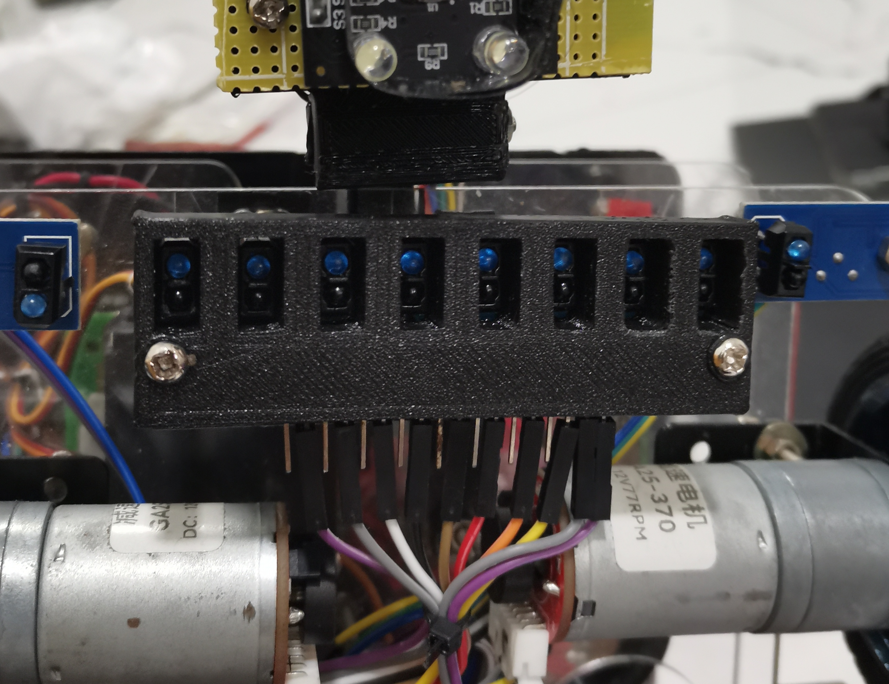
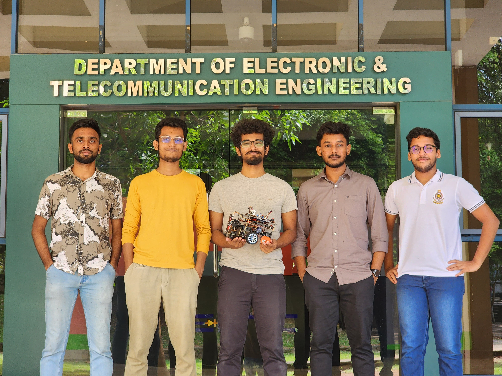

# EN2533-Pulztrones
## EN2533 Robot Design and Competition

## 📖 Project Overview

Our robot was designed to complete a series of challenges inspired by the *Stranger Things* universe. The competition featured tasks such as line navigation, maze-solving, box manipulation, and terrain traversal. The project involved extensive hardware and software development, with the final product demonstrating the capability to autonomously navigate and solve challenges within a specified arena.

## 🤖 Robot

## 🔧 Robot Hardware Specifications
- **Dimensions**: 250mm x 250mm
- **Power Supply**: 3 cell Li-po battery with a voltage of 11.1V DC.
- **Components**:
  - Arduino Mega Board
  - Raykha S8 – TCRT5000 based 8 channel Reflective Sensor Array
  - 12V 77rpm brushed DC motors
  - MG90 metal wheel servo motors
  - VL53L0XV2 Time of flight sensors
  - Ultrasonic sensors
  - TCS230 Color sensor
  - DC-DC step down buck module
  - DC-DC step up boost module
  - LEDs for status indication
  - 0.96 inch OLED display for debugging

## 💻 Robot Software Specifications
- **Programming Language**: C++
- **IDE**: VS Code (PlatformIO)
- **Libraries**:
  - Arduino.h
  - QTRSensors
  - Wire
  - Adafruit_GFX
  - Adafruit_SSD1306
  - VL53L0X
- **3D Modelling Software**: SolidWorks

## ⚙️ Mechanisms
### Gripper Mechanism
The gripper mechanism is designed to handle box manipulation tasks efficiently. It consists of two servo motors: one to lift the entire mechanism vertically in a rotational motion and another to control the arms for grabbing the box. The vertical lifting motion prevents the box from sliding along the ground and helps avoid collisions with uneven terrain. Additionally, the mechanism includes a color sensor to identify the color of the line being followed. A ToF (Time-of-Flight) sensor tower with three ToF sensors is integrated to detect the height of the boxes, measure the distance between the robot and the boxes, and check if the portal is open. This combination of sensors ensures precise box handling and accurate navigation during tasks.

    
    

### Coin Dropper Mechanism
The coin dropper mechanism is a simple yet effective design for placing coins in a given location. It consists of a servo motor connected to a custom-designed part that holds the coin. The part rotates horizontally, and when it aligns with the hole in the base, the coin drops into the designated spot.In the final task, the robot encounters a black cross marked on the uneven terrain. This black cross indicates the location where the coin needs to be dropped. The mechanism ensures smooth and controlled coin placement, minimizing errors and enhancing reliability even on challenging surfaces.

    
    

## 🚩 Competition Tasks

The competition was structured into multiple tasks, each testing a different aspect of robot performance:

- **Task 1: Line Navigation** – Navigate lines of varying widths and identify a binary code.

- **Task 2: Maze Navigation and Box Manipulation** – Grab a virtual box and move it through a maze with limited movement capabilities.

- **Task 3: Color Line Following** – Follow a specific color line based on previously completed checkpoints.

- **Task 4: Dashed Line Navigation** – Track a white dashed line.

- **Task 5: Portal Navigation** – Time the robot's passage through a portal that opens and closes periodically.

- **Task 6: Box Arrangement** – Rearrange boxes based on task requirements.

- **Task 7: Hidden Task and Chamber Insertion** – Complete an unknown task revealed during the competition.

- **Task 8: Coin Drop and Task Completion** – Navigate uneven terrain and drop a coin at a specified spot and finish the task.
#### [📘 Robot Design and Competition 2024 Task File](docs/Robot%20Design%20and%20Competition%202024%20Task%20v1.1_compressed.pdf)

## 🏟️ Arena

## 🏆 Achievements
- First Place in the EN2533 Robot Design and Competition
- Completed 7 out of 8 tasks within the time limit.
#### [Check Out our Robot in Action](https://www.youtube.com/shorts/98-_jfOEn1Y?feature=share)

## 💡Testing Issues & Innovative Fixes

### • Reverse Line Following Challenge
#### Problem
During maze navigation, we encountered a challenge with reverse line-following. We had two options for this: using encoders or the IR array. However, due to the motors being slightly different from each other, using encoders was inefficient for reverse line-following. Moreover, since the IR array was positioned in front of the wheels, it became ineffective during reverse line-following. This is because, when moving in reverse, the IR array was behind the motors in relation to the direction of travel. As a result, the sensors would detect the line after the motors had already moved, leading to a delay in feedback and making the line-following inefficient during reverse navigation.

#### Solution
To address this, we used two IR arrays—one for forward line-following and another positioned behind the motors for reverse line-following. This setup allowed the robot to receive immediate feedback during both forward and reverse navigation, ensuring efficient and accurate line-following in both directions. Additionally, this solution largely reduced the coding complexity, as we no longer had to account for motor inconsistencies or complex adjustments for reverse navigation.

### • Line Following Challenge: IR Sensor Isolation
#### Problem
During our testing, we encountered an issue with the IR sensor array while performing line-following tasks. The array performed well when following a white line on a black background, but it struggled when detecting a black line on a white background. This challenge arose due to the lack of isolation between the IR receivers, causing interference from reflected IR rays emitted by other sensors. The large white background led to inaccurate sensor readings, and this was mainly caused by the need to keep the IR array elevated above the ground to navigate uneven terrain.
#### Solution
To address this challenge, we created a custom cover using SolidWorks to isolate the IR receivers. The new design ensures that only the IR rays emitted by the same sensor are received, effectively minimizing interference. This allows only the perpendicular reflected rays to reach the receivers, improving the accuracy of the sensor readings.

## 👥 Group Members
| Name | Index Number |Email|
|------|--------------|--------------|
| Balasooriya B A P I | 220054N | balasooriyabapi.22@uom.lk |
| Liyanage D L B B | 220362G |banuka2002liyanage@gmail.com|
| Pathirana P D R O | 220448C |oshadha1619@gmail.com|
| Fernando A R D | 220161N |rusirufernando513@gmail.com|
| Dineshara M C | 220128V |chandupadineshara@gmail.com|

<!-- # Pin Assignment
| **Pin Number** | **Mode**             | **Assigned Name**     |
|----------------|----------------------|-----------------------|
| 0              | Digital I/O (UART RX) |                       |
| 1              | Digital I/O (UART TX) |                       |
| 2              | Digital I/O, PWM      |                       |
| 3              | Digital I/O, PWM      |  B2 (Select)          |
| 4              | Digital I/O, PWM      |        enbPin         |
| 5              | Digital I/O, PWM      |        enaPin         |
| 6              | Digital I/O, PWM      |    mechanism gripper  |
| 7              | Digital I/O           |  arm servo      |
| 8              | Digital I/O           |  coin  servo    |
| 9              | Digital I/O, PWM      |                       |
| 10             | Digital I/O, PWM      |                       |
| 11             | Digital I/O, PWM      |                       |
| 12             | Digital I/O           |                       |
| 13             | Digital I/O           |                       |
| 14             | Digital I/O (UART TX) |                       |
| 15             | Digital I/O (UART RX) |                       |
| 16             | Digital I/O (UART TX) |       Bluetooth       |
| 17             | Digital I/O (UART RX) |       Bluetooth       |
| 18             | Digital I/O (UART TX) |   RIGHT_ENCODER_PIN_A |
| 19             | Digital I/O (UART RX) |    LEFT_ENCODER_PIN_A |
| 20             | Digital I/O (I2C SDA) |          I2C   MUX    |
| 21             | Digital I/O (I2C SCL) |          I2C   MUX    |
| 22             | Digital I/O           |   rightMotorBackward  |
| 23             | Digital I/O           |   rightMotorForward   |
| 24             | Digital I/O           |   leftMotorBackward   |
| 25             | Digital I/O           |   leftMotorForward    |
| 26             | Digital I/O           |   RIGHT_ENCODER_PIN_B |
| 27             | Digital I/O           |   LEFT_ENCODER_PIN_B  |
| 28 >>31        | Digital I/O           |    Ultrasonic Eco     |
| 29 >>32        | Digital I/O           |    Ultrasonic Trigger |
| 30             | Digital I/O           |         Buzzer        |
| 31             | Digital I/O           |      I2c MUX A0       |
| 32             | Digital I/O           |    I2c MUX A1         |
| 33             | Digital I/O           |    I2c MUX A2         |
| 34             | Digital I/O           |       B1 (UP/NEXT)    |
| 35             | Digital I/O           |                       |
| 36             | Digital I/O           |       B3 (Back)       |
| 37             | Digital I/O           |       BLUE LED        |
| 38             | Digital I/O           |       S0              |
| 39             | Digital I/O           |        OUT            |
| 40             | Digital I/O           |         S2            |
| 41             | Digital I/O           |           S3          |
| 42             | Digital I/O           |            S1         |
| 43             | Digital I/O           |                       |
| 44             | Digital I/O, PWM      |                       |
| 45             | Digital I/O, PWM      |                       |
| 46             | Digital I/O, PWM      |                       |
| 47             | Digital I/O           |                       |
| 48             | Digital I/O           |                       |
| 49             | Digital I/O           |                       |
| 50             | Digital I/O (SPI MISO)|      Mosfet 2         |
| 51             | Digital I/O (SPI MOSI)|                       |
| 52             | Digital I/O (SPI SCK) |      Mosfet 1 (arm)   |
| 53             | Digital I/O (SPI SS)  |      RED LED          |
| A0             | Analog Input          |      Raykha A0        |
| A1             | Analog Input          |      Raykha A1        |
| A2             | Analog Input          |      Raykha A2        |
| A3             | Analog Input          |      Raykha A3        |
| A4             | Analog Input          |      Raykha A4        |
| A5             | Analog Input          |      Raykha A5        |
| A6             | Analog Input          |      Raykha A6        |
| A7             | Analog Input          |      Raykha A7        |
| A8             | Analog Input          |    MArker sensor  R   |
| A9             | Analog Input          |    MArker sensor  L   |
| A10            | Analog Input          |                       |
| A11            | Analog Input          |                       |
| A12            | Analog Input          |                       |
| A13            | Analog Input          |                       |
| A14            | Analog Input          |                       |
| A15            | Analog Input          |                       |-->
